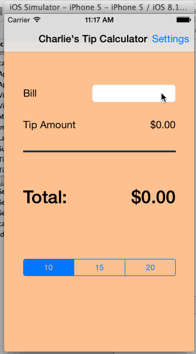

### Charlie's Tip Calculator

Time Spent: 2 hours

Which required and optional stories have you completed?
- Required: Accurately calculate tip/total amounts based on bill amount and user selected tip percentage 
- Required: User can change default tip percentages in Settings view
- Required: Main view and Settings view show tip percentages based on user's change
- Required: Re-calculate tip/total amounts based on the new tip percentage after user's change  

GIF walkthrough of all required and optional stories
